# Codex Chef

<p align="center">
  
  <br />
  
</p>

<p align="center">
  <a href="https://github.com/ucsahinn/codex-chef/actions/workflows/validate.yml"></a>
  <a href="LICENSE"></a>
  <a href="README.md"></a>
  
</p>

<p align="center">
  🌐 <strong>Docs:</strong>
  <a href="README.de.md">Deutsch</a> |
  <a href="README.es.md">Español</a> |
  <a href="README.md">English</a> |
  <a href="README.pt-BR.md">Português (Brasil)</a> |
  <a href="README.tr.md">Türkçe</a> |
  <a href="README.fr.md">Français</a>
</p>

Codex Chef gives a Windows-first Codex setup a clean starting point: safer defaults, a named specialist team, curated skills, MCP defaults, local plugin workflows, and validation that users can inspect before anything touches their machine.

This is an unofficial community starter, not an OpenAI product. It is mapped to current official Codex documentation and keeps risky actions approval-gated by default.

The multilingual README entry points and six-language deep docs coverage are part
of the release surface, so users do not have to start from English-only docs.

## 🚀 Copy-Paste Install

Windows PowerShell:

```powershell
git clone https://github.com/ucsahinn/codex-chef.git
cd codex-chef
Set-ExecutionPolicy -Scope Process Bypass -Force
.\scripts\install.ps1 -All -Interactive
```

Safe preview first:

```powershell
.\scripts\install.ps1 -All -WhatIf
node scripts/plan-install.mjs --all --json --redact-paths
```

Repair an existing global Codex setup without deleting user skills:

```powershell
.\scripts\install.ps1 -Repair -WhatIf
.\scripts\install.ps1 -Repair
```

Automation-friendly one-shot install without questions:

```powershell
.\scripts\install.ps1 -All
```

## 🍳 What You Get After Install

Codex Chef installs a reviewed Codex baseline, not a hidden sync from someone
else's machine. The install source is this repo: `templates/codex/config.*.toml`,
`templates/codex/agents/*.toml`, `plugins/codex-chef-workflows`, and the
manifest-backed install plan.

| Surface | What lands on your machine |
| --- | --- |
| 🤖 Agent team | 21 registered Codex subagent role files under `~/.codex/agents/*.toml`. |
| 🧠 Durable guidance | Global `~/.codex/AGENTS.md` with safe routing, verification, and approval rules. |
| 🔌 MCP defaults | 7 useful MCP servers enabled and 8 authenticated/high-risk connectors parked disabled. |
| 🧩 Plugin + skills | Local `codex-chef-workflows` plugin, three bundled skills, and sixteen optional curated global skills. |
| 🛡️ Safety gates | Backups, dry-run planning, secret scanning, validation, and approval-gated risky actions. |

At the end of the installer, Codex Chef prints a capability board with the
agent team, default-ready MCPs, disabled opt-in MCPs, local plugin skills, and
reviewed global skills. It also prints MCP setup notes for tooling, OAuth,
filesystem-path, and `SUPABASE_DB_URL` requirements, so first-run gaps are
visible before a task needs the connector. That is the quick "what did I just
get?" screen after setup.

### Enterprise Routing Board

Codex Chef also ships `catalog/routing-profiles.json`, a machine-readable
task-shape routing contract. It tells Codex which subagents, skills, MCPs, and
config/profile flags should be used for common enterprise work such as current
docs research, context placement, bug root cause, frontend verification,
security review, MCP connector changes, release readiness, SEO, docs, and
starter health.

```bash
npm run codex:routing
npm run codex:status
```

This is safe autonomy, not hidden execution. Matching agents, skills, MCPs, and
flags are required when the task shape appears, but destructive, credentialed,
publishing, deployment, database, and broad filesystem actions stay
approval-gated.

### 🔌 MCP Connector Board

Codex Chef treats MCPs as explicit capabilities, not hidden account sync. The
useful local/research connectors are ready; account, database, production, and
broad filesystem connectors stay parked until you opt in.

| Status | MCPs | Why |
| --- | --- | --- |
| ✅ Ready by default | 📚 OpenAI Docs · 🧭 Context7 · 🧠 Sequential Thinking · 🎭 Playwright · 🧰 Chrome DevTools · 🗺️ Serena · 🧩 Memory | Safe research, code navigation, browser evidence, and local non-secret context. |
| 🔒 Disabled by default | 📁 Filesystem · 🐙 GitHub · 🎨 Figma · 📌 Linear · 🗒️ Notion · 🚨 Sentry · ▲ Vercel · 🗄️ Supabase | These can expose private files, accounts, telemetry, deployments, or databases, so you enable them only when the task needs them. |

Run `npm run codex:status` after install to see the live MCP setup board,
effective routing controls, and any installed-runtime drift without mutating
global Codex state.

If `~/.codex/config.toml` already exists, the installer backs it up and merges
only missing Codex Chef agent/MCP/safety tables. Your existing MCP entries,
tokens, profiles, and tuned settings are preserved unless you deliberately use
`-Force` / `--force`.

## 🤖 Installed Agent Team

These are Codex subagent role definitions, not separate background services.
Codex uses their names, descriptions, and TOML role files when routing a task.

- 🗺️ **Code Mapper** (`code_mapper`) - repo map
- 📚 **Docs Researcher** (`docs_researcher`) - official docs
- 🧭 **Context Architect** (`context_architect`) - routing surface
- ✍️ **Prompt Architect** (`prompt_architect`) - prompt system
- 🔌 **MCP Integrator** (`mcp_integrator`) - connectors
- 🎯 **Product Strategist** (`product_strategist`) - scope
- 🏗️ **Engineering Planner** (`engineering_planner`) - architecture
- 🎨 **Design Reviewer** (`design_reviewer`) - UX polish
- 🧰 **DevEx Auditor** (`devex_auditor`) - onboarding
- 🕵️ **Root-Cause Debugger** (`root_cause_debugger`) - investigation
- ✅ **QA Lead** (`qa_lead`) - user flows
- ⚡ **Performance Auditor** (`performance_auditor`) - speed
- 🔎 **Google SEO Auditor** (`google_seo_auditor`) - search visibility
- 📝 **Docs Author** (`docs_author`) - docs coverage
- 📐 **Spec Author** (`spec_author`) - executable specs
- 🔍 **Code Reviewer** (`code_reviewer`) - fresh review
- 🖥️ **Frontend Verifier** (`frontend_verifier`) - rendered UI
- 🛡️ **Security Auditor** (`security_auditor`) - threat paths
- 🧪 **Test Verifier** (`test_verifier`) - test evidence
- 🚢 **Release Verifier** (`release_verifier`) - publish gates
- 🩺 **Codex Doctor** (`codex_doctor`) - setup health

## 🧩 Skills Included

Codex Chef ships three local plugin skills. They are bundled with the
`codex-chef-workflows` plugin and are checked by `npm run validate:plugin-skills`
so they cannot quietly drift out of the repo. With `-All` or `-InstallSkills`,
the installer can also add sixteen reviewed public and first-party skills for maintenance,
debugging, refactoring, security, testing, browser verification, SEO, web
quality, docs, MCP building, context engineering, prompt architecture, skill
authoring, and one broad frontend workflow.

- 🍳 **Chef Operator** (`codex-chef-operator`) - plugin-local
- 📐 **Offline Diagram Triplet** (`offline-diagram-triplet`) - plugin-local
- 🧮 **Context Budget Planner** (`context-budget-planner`) - plugin-local
- ⬆️ **Dependency Upgrade** (`dependency-upgrade`) - optional global
- 🖼️ **Frontend Builder** (`frontend-skill`) - optional global
- 🛡️ **Security Best Practices** (`security-best-practices`) - optional global
- 🧯 **GitHub CI Fixer** (`gh-fix-ci`) - optional global
- 🕵️ **Systematic Debugging** (`systematic-debugging`) - optional global
- 🧱 **Refactor Planner** (`request-refactor-plan`) - optional global
- 🧭 **Webapp Testing** (`webapp-testing`) - optional global
- 🧪 **Test-Driven Development** (`test-driven-development`) - optional global
- 🔎 **SEO** (`seo`) - optional global
- ♿ **Accessibility** (`accessibility`) - optional global
- 📊 **Web Quality Audit** (`web-quality-audit`) - optional global
- 📝 **Documentation And ADRs** (`documentation-and-adrs`) - optional global
- 🔌 **MCP Builder** (`mcp-builder`) - optional global
- 🧱 **Context Starter** (`ai-project-starter`) - optional global, first-party
- ✍️ **Prompt Architect Skill** (`prompt-architect`) - optional global, first-party
- 🛠️ **Skill Forge** (`ai-skill-create`) - optional global, first-party

Extra design, React/Vercel, prompt, memory, token, and context skills stay in
`catalog/skills.json` as manual opt-ins instead of default installs. That keeps
the starter broad without losing references such as `impeccable`,
`design-taste-frontend`, `image-to-code`, `high-end-visual-design`,
`web-design-guidelines`, `vercel-react-best-practices`, `vercel-optimize`,
`vercel-cli-with-tokens`, `context-map`, and `what-context-needed`.

The key distinction: Codex Chef solves LLM token/context planning with the
bundled local `context-budget-planner`; deployment-token or vendor-auth skills
remain opt-in because they can touch accounts or duplicate existing triggers.

First-party ecosystem skills are part of the reviewed `-All` / `-InstallSkills`
set:

- 🧱 `ai-project-starter` - project context foundations,
  starter docs, agent instruction files, and vibe-coding guardrails.
- ✍️ `prompt-architect` - plan-first, approval-gated Codex
  prompt packages and prompt audits.
- 🛠️ `ai-skill-create` - create, validate, forward-test, and package Codex
  skills and plugins.

Manual opt-in example:

```bash
npx skills add pbakaus/impeccable --skill impeccable --agent codex --yes --global
```

## 🔌 MCP Defaults

Codex Chef installs MCP config entries, not hidden account connections. Useful
local/research servers are enabled; authenticated, database, production, and
broad filesystem connectors stay disabled until a task explicitly needs them.

Default enabled:

- 📚 **OpenAI Developer Docs** (`openaiDeveloperDocs`) - official OpenAI/Codex docs.
- 🧭 **Context7** (`context7`) - current library and framework docs.
- 🧠 **Sequential Thinking** (`sequential-thinking`) - structured decomposition for complex tasks.
- 🎭 **Playwright** (`playwright`) - browser snapshots, console/network evidence, and UI checks.
- 🧰 **Chrome DevTools** (`chrome-devtools`) - isolated Chrome inspection with redacted network headers.
- 🗺️ **Serena** (`serena`) - semantic code navigation and repo symbol search.
- 🧩 **Memory** (`memory`) - local memory graph for non-secret project context.

Default disabled until opt-in:

- 📁 **Filesystem** (`filesystem`) - broad local file access; set an intentional path before enabling.
- 🐙 **GitHub** (`github`) - private repo/PR context through account authorization.
- 🎨 **Figma** (`figma`) - private design files and workspace context.
- 📌 **Linear** (`linear`) - issues, projects, and team planning context.
- 🗒️ **Notion** (`notion`) - private docs and databases.
- 🚨 **Sentry** (`sentry`) - production error and telemetry context.
- ▲ **Vercel** (`vercel`) - project and deployment platform context.
- 🗄️ **Supabase** (`supabase`) - database access through `SUPABASE_DB_URL`.

If a user already has `~/.codex/config.toml`, the installer now preserves it and
adds only missing Codex Chef agent/MCP/safety tables. Existing MCP entries,
tokens, profiles, and user-tuned settings are not overwritten unless `-Force` /
`--force` is used after preview and backup.

## &#127760; Language Entry Points

| Language | README |
| --- | --- |
| 🇩🇪 | [README.de.md](README.de.md) |
| 🇪🇸 | [README.es.md](README.es.md) |
| 🇬🇧 | [README.md](README.md) |
| 🇧🇷 | [README.pt-BR.md](README.pt-BR.md) |
| 🇹🇷 | [README.tr.md](README.tr.md) |
| 🇫🇷 | [README.fr.md](README.fr.md) |

## ⚡ Start Here

| Goal | Link |
| --- | --- |
| Install safely | [Quick Start](#-quick-start) |
| Preview changes before writing anything | [Dry Run](#-dry-run-first) |
| Inspect the full install plan | [Install Plan](#-install-plan) |
| See what gets installed | [Install Surface](#-install-surface) |
| Understand Codex capabilities | [Capability Map](docs/codex-capability-map.md) |
| Map ECC/GStack-style workflows | [Workflow Surface Map](docs/workflow-surface-map.md) |
| Verify before publishing | [Verification](docs/verification.md) |
| Read release notes | [Release Notes](docs/release-notes.md) |
| Prepare GitHub metadata | [GitHub Settings](docs/github-settings.md) |
| Review advisory inputs | [Advisory Sources](docs/advisory-sources.md) |
| Troubleshoot Windows/Codex issues | [Troubleshooting](docs/troubleshooting.md) |
| Upgrade an existing setup | [Upgrade Guide](docs/upgrade.md) |

## 🧭 What This Repo Is

Codex Chef turns scattered local setup knowledge into a public, reviewable starter repository. It helps users answer:

- What should live in `AGENTS.md`, config, skills, plugins, MCP, rules, or hooks?
- Which connectors are safe by default?
- Which global files are touched by setup?
- How do I verify this before trusting it?
- How do I extend it without leaking secrets or weakening approvals?

## 🧩 Install Surface

The installers copy these managed templates:

- `~/.codex/AGENTS.md`
- `~/.codex/config.toml`
- `~/.codex/agents/*.toml`
- `~/.codex/rules/default.rules`
- `~/.codex/plugins/codex-chef-workflows`
- `~/.agents/plugins/marketplace.json`

Optional switches can also install:

- Global Git ignore rules at `~/.gitignore_global`
- A global Git pre-commit hook under `~/.githooks`
- Curated public Codex skills from `catalog/skills.json`

## 🚫 What It Does Not Do

The installer does not:

- Store tokens, cookies, auth files, private keys, memories, sessions, or local project state.
- Enable authenticated account, database, production, or broad filesystem MCP connectors by default.
- Commit, push, create releases, deploy, publish packages, rotate secrets, or change GitHub settings.
- Delete user data without first backing up managed targets, unless the user explicitly chooses `-NoBackup` or `--no-backup`.

## 🔎 Dry Run First

PowerShell safe preview:

```powershell
.\scripts\install.ps1 -All -WhatIf
```

Bash or WSL safe preview:

```bash
./scripts/install.sh --all --dry-run
```

Dry runs print the target Codex/Agents homes and the changes that would happen without touching real files, Git settings, or global skills.

## 🧾 Install Plan

For a machine-readable no-write plan:

```bash
node scripts/plan-install.mjs --all --json
```

For quick discovery before reading the full JSON:

```bash
node scripts/plan-install.mjs --list-profiles
node scripts/plan-install.mjs --list-operations
```

The plan is backed by `manifests/install-plan.json` and records each managed
operation, collision policy, backup behavior, risk level, and required flag.
It is inspired by ECC's manifest-driven install architecture, but remains
Codex-only and does not import ECC's global config, hooks, MCPs, or skill
catalog. See [ECC Compatibility](docs/ecc-compatibility.md).

## ⚡ Quick Start

PowerShell:

```powershell
git clone https://github.com/ucsahinn/codex-chef.git
cd codex-chef
Set-ExecutionPolicy -Scope Process Bypass -Force
.\scripts\install.ps1 -All -Interactive
```

Bash or WSL:

```bash
git clone https://github.com/ucsahinn/codex-chef.git
cd codex-chef
chmod +x scripts/install.sh
./scripts/install.sh --all
```

After installation, restart Codex and run:

```bash
codex doctor --summary
npm run codex:status
npm run verify:install:runtime
codex --strict-config "Summarize the active Codex setup."
```

Use `-InstallSkills` / `--install-skills` or `-InstallGitGuards` / `--install-git-guards` when you only want one optional part of the setup.
`-All` includes the reviewed skill set, but it does not change global Git
config unless you also opt in to Git guards.

Existing user config is protected by default: if `~/.codex/config.toml`
already exists, the installer backs it up and merges only missing Codex Chef
agent/MCP/safety tables. Existing tables are preserved. Other managed files
such as `AGENTS.md`, agent files, rules, and the plugin marketplace are skipped
unless you explicitly add `-Force` / `--force`. Use force only for a deliberate
upgrade after reviewing the preview; the installer backs up managed targets
first.

For existing global Codex users, prefer repair before force. `-Repair` /
`--repair` previews or applies backup-backed reconciliation for Codex
Chef-managed files, merges missing config blocks, refreshes the plugin
marketplace entry without dropping unrelated plugins, and reports extra or
duplicate global skills as cleanup candidates instead of deleting them.

## 🧠 Operating Model

1. Map unfamiliar code with `code_mapper`.
2. Use `context_architect` when you need to decide whether behavior belongs in prompts, `AGENTS.md`, skills, plugins, MCP, hooks, memory, rules, or config.
3. Verify current APIs and product behavior with `docs_researcher`; use `prompt_architect` for reusable prompts, briefs, and instruction systems.
4. Use `mcp_integrator` before enabling or troubleshooting connectors and MCP tool exposure.
5. Implement in the main thread with repo instructions and selected skills.
6. Use `test_verifier`, `frontend_verifier`, or `security_auditor` when the task needs deeper evidence.
7. Use `codex_doctor` for starter health and drift checks.
8. Use `release_verifier` before push, tag, release, package, deploy, or publication.

The result is a small specialist-team workflow inside Codex while the main thread stays focused on decisions, implementation, and final evidence.

## 🎬 Visual Overview

<p align="center">
  
</p>

## 🛡️ Safe Defaults

- Sandbox stays enabled.
- Approval policy stays interactive.
- Workspace command network access stays off.
- Shell subprocesses inherit only a trimmed environment with default secret exclusions.
- Authenticated remote connectors stay disabled until a task needs them.
- MCP tools that can touch external systems prompt before risky actions.
- Skills are installed only from package/skill pairs in the catalog and lock file.
- Deletion, cleanup, overwrite, credential access, publish, push, and release operations remain approval-gated.

## ✅ Trust Signals

| Signal | Evidence |
| --- | --- |
| 🛡️ Public-safe by design | No tokens, auth files, sessions, memories, cookies, private keys, or machine-specific state are included. |
| 🧪 Real validation | `npm run check` runs repo, docs, install-plan, agent drift, MCP drift, skill-source, supply-chain, and security checks. |
| 🔐 Secret scanning ready | Gitleaks command is documented and the Git hook runs it when available. |
| 🌐 Multilingual docs | Deutsch, Español, English, Português (Brasil), Türkçe, and Français README and deep documentation files are present; six-language deep docs are enforced by validation. |
| 🎬 Accessible visuals | SVG assets include title, description, motion, reduced-motion fallback, and README alt text. |
| 🧩 Skill source gate | `catalog/skills-lock.json` is checked against installable skill metadata. |
| 🧩 Local skill gate | `npm run validate:plugin-skills` checks every bundled skill, reference file, UI metadata file, and catalog entry. |
| 📐 Offline diagrams | Bundled `offline-diagram-triplet` emits Mermaid, editable Excalidraw, SVG, PNG, and Markdown with zero network. |
| 🧮 Context budget | Bundled `context-budget-planner` keeps large tasks focused with source priority, token budgeting, and compaction handoff. |
| 🤖 Agent drift gate | `catalog/agents.json` and `catalog/agent-research-corpus.json` are checked against Windows/Unix config blocks, role TOML files, required guardrail blocks, and source-backed item counts. |
| 🩺 Doctor gate | `npm run codex:doctor` summarizes repo-only Codex starter health without global writes. |
| 📟 Status board | `npm run codex:status` combines repo health, installed runtime drift, Codex doctor checks, and skill context-budget warnings. |
| Repair mode | `npm run repair:install -- --apply` and installer `-Repair` / `--repair` fix managed drift after backup while preserving unrelated marketplace plugins and user skills. |
| 🧾 Install plan gate | `manifests/install-plan.json` and the install-state preview schema are validated before installer execution. |
| 🔌 Conservative MCPs | Authenticated account, database, and broad filesystem connectors stay disabled. |
| 🧭 Source-backed guidance | Research notes record source type, confidence, support, and outdated-risk. |
| Agent-readable index | `llms.txt` gives coding agents a compact map of install targets, docs, safety boundaries, and high-signal comparison sources. |
| 📣 Public-safe triage | CODEOWNERS and issue templates route bugs, features, questions, and security reports without private data. |
| ♻️ CI alignment | GitHub Actions runs the same `npm run check` path plus shell parser checks. |

## 📁 Repository Layout

```text
.github/                 CI workflow plus issue and PR templates
assets/                  Public-safe README visuals
catalog/                 Skill and MCP source metadata
README*.md               Multilingual public entry points
docs/                    Six-language setup and verification guides
manifests/               No-write install plan metadata
plugins/                 Bundled local Codex plugin
schemas/                 Lightweight validation schemas
scripts/                 Install, doctor, and validation scripts
templates/codex/         Files copied into ~/.codex
templates/git/           Optional global Git hygiene files
```

## 🧾 Verify Locally

```bash
npm run check
git diff --check
gitleaks detect --redact --no-banner --no-git --verbose
```

Optional online skill-source check:

```bash
npm run verify:skills:online
```

Online skill verification uses the network and the Skills CLI. It is intentionally separate from the default offline gate.

## 📚 Documentation

Every deep guide has English, German, Spanish, Brazilian Portuguese, Turkish, and French files. For example, `docs/install.md` is paired with `docs/install.de.md`, `docs/install.es.md`, `docs/install.pt-BR.md`, `docs/install.tr.md`, and `docs/install.fr.md`.

- [Install](docs/install.md)
- [Troubleshooting](docs/troubleshooting.md)
- [Expected output](docs/expected-output.md)
- [Upgrade guide](docs/upgrade.md)
- [Codex capability map](docs/codex-capability-map.md)
- [Workflow surface map](docs/workflow-surface-map.md)
- [Codex surfaces](docs/codex-surfaces.md)
- [Skills and agents](docs/skills-and-agents.md)
- [MCP catalog](docs/mcp-catalog.md)
- [Security model](docs/security-model.md)
- [Verification](docs/verification.md)
- [Public readiness](docs/public-readiness.md)
- [SEO and discoverability](docs/seo.md)
- [Research notes](docs/research-notes.md)
- [Advisory sources](docs/advisory-sources.md)
- [Publishing](docs/publish.md)
- [Agent-readable index](llms.txt)

## 📚 Official Codex References

Primary source: https://developers.openai.com/codex/codex-manual.md

Focused docs:

- Skills: https://developers.openai.com/codex/skills
- Plugins: https://developers.openai.com/codex/plugins
- MCP and connectors: https://developers.openai.com/api/docs/guides/tools-connectors-mcp
- Windows: https://developers.openai.com/codex/windows
- Config, permissions, rules, hooks, and AGENTS.md are mapped in [docs/research-notes.md](docs/research-notes.md).

## 🚀 Publishing Boundary

This repo is built to be public-ready after validation, but the installer is local-only. Commit, push, tag, release, package publishing, deployments, and GitHub settings changes must be explicit human decisions after local verification.
