# Codex Chef

<p align="center">
  
</p>

<p align="center">
  <a href="https://github.com/ucsahinn/codex-chef/actions/workflows/validate.yml"></a>
  <a href="LICENSE"></a>
  <a href="README.md"></a>
  
</p>

<p align="center">
  <strong>Dil:</strong>
  <a href="README.tr.md">Türkçe</a> ·
  <a href="README.md">English</a> ·
  <a href="README.de.md">Deutsch</a> ·
  <a href="README.es.md">Español</a> ·
  <a href="README.fr.md">Français</a> ·
  <a href="README.pt-BR.md">Português (Brasil)</a>
</p>

Codex'i çalıştırmaya başlamak kolay. Onu bir hafta sonra da düzenli, faydalı ve
güvenli kalan bir çalışma ortamına dönüştürmek ise gereğinden fazla uğraştırıyor.

Ben **Codex Chef**'i bu yüzden geliştirdim. Kendi kullanımımda sürekli aynı
sorulara dönüyordum: Bu işi hangi agent üstlenmeli, hangi skill yol göstermeli,
hangi MCP güvenli, nerede onay istenmeli ve ortaya çıkan sonucu gerçekten nasıl
doğrulayacağım?

Codex Chef, [OpenAI Codex](https://developers.openai.com/codex) için hazırladığım
resmi olmayan, açık kaynak bir kurulum ve çalışma kiti. Başkasının özel
bilgisayarını, credential'larını, session'larını veya lokal memory'sini
kopyalamadan sağlam bir başlangıç düzeni kurar.

> **Ana odağı Codex.** Buradaki fikirler başka terminal agent'larına
> uyarlanabilir; fakat repo doğrudan Claude veya her istemciyle hazır uyumluluk
> iddia etmez.

## 👋 Aradığın Yerden Başla

| İncele | Ne bulacaksın? |
| --- | --- |
| [🤖 21 agent'ın tamamını gör](docs/agents.tr.md) | Her uzman rolün ne yaptığını, ne zaman seçildiğini ve delegasyonun ne zaman gerçekten faydalı olduğunu. |
| [🧩 Skill kataloğunu aç](docs/skills.tr.md) | Dokuz bundled workflow'u, full install ile gelen on beş incelenmiş skill'i ve varsayılan yolu kalabalıklaştırmayan opsiyonları. |
| [🔌 MCP kataloğuna bak](docs/mcp-catalog.tr.md) | Varsayılan açık sekiz MCP'yi, gerektiğinde açılan sekiz connector'ı, gereksinimleri ve erişim sınırlarını. |
| [🛡️ Güvenlik modelini oku](docs/security-model.tr.md) | Ön izleme, yedekleme, onay kapıları, secret sınırları ve Codex Chef'in bilerek kendi başına yapmadığı işlemleri. |

## 🍳 Codex Chef Neler Ekliyor?

### Agent'lar: yalnızca gerektiğinde doğru uzman

Starter; `code_mapper`, `root_cause_debugger`, `security_auditor`,
`docs_author` ve `test_verifier` gibi uzman roller içeriyor. Bunlar arka planda
sürekli çalışan servisler değil. Bir rolün görevle eşleşmesi yol gösterir;
Codex ancak iş güvenli biçimde bölünebiliyorsa veya sen açıkça istersen subagent
başlatır.

[Tüm agent'ları ve gerçek rol dosyalarını gör →](docs/agents.tr.md)

### Skill'ler: aynı işi her seferinde düzgün yapabilmek için

Skill, Codex'e belirli bir işi hangi adımlarla yapacağını anlatır. Codex önce
kısa açıklamayı görür; tam talimatı yalnızca görev eşleştiğinde yükler. Codex
Chef dokuz lokal plugin workflow'u sunar ve full install profilinde on beş
incelenmiş skill'e yer verir. Dokuz lokal workflow'un tamamı yönetilen direct
skill olarak senkronize edilir; `$adaptive-agent-routing`,
`$context-budget-planner`, `$fetch`, `$seo` ve `$evidence-research` gibi
çağrılar ayrı bir plugin kurulumu olmadan çalışır. Plugin namespace'i ise
marketplace plugin'i kurulduktan ve yeni bir Codex oturumu açıldıktan sonra
kullanılabilir.

[Hangisi bundled, hangisi kurulur, hangisi opsiyonel gör →](docs/skills.tr.md)

### MCP'ler: canlı araç ve context, fakat sınırları görünür

MCP; Codex'i dokümantasyona, browser'a, semantic code navigation'a, memory'ye
ve lokal codebase graph okumalarına bağlar. `openaiDeveloperDocs`, `context7`,
`playwright`, `chrome-devtools`, `serena`, `memory`,
`sequential-thinking` ve `codebase-memory` kullanışlı varsayılanlar olarak
yapılandırılır. Hesap, database, production ve geniş filesystem connector'ları
sen bilerek açana kadar kapalı kalır.

[Tüm MCP'leri, önkoşulları ve erişim sınırlarını gör →](docs/mcp-catalog.tr.md)

## 🧭 Parçalar Birlikte Nasıl Çalışıyor?

<p align="center">
  
</p>

Sen işi anlatırsın. Routing en dar ve faydalı yüzeyi seçer. Riskli işlemler
onay için durur. Doğrulama, gerçekte ne olduğunu kontrol eder.

## 🚀 Önce Gör, Sonra Kur

Git, Node.js 18 veya üzeri, npm/npx ve Codex gerekir. Bunlardan biri eksikse
tahmin yürütmek yerine [kurulum rehberine](docs/install.tr.md) bakabilirsin.

```powershell
git clone https://github.com/ucsahinn/codex-chef.git
cd codex-chef
npm run chef -- --install
```

İlk komut yalnızca ön izleme yapar. Codex home'a yazmadan önce Codex Chef'in
hangi dosyaları yöneteceğini gösterir.

Ön izleme doğruysa:

```powershell
npm run chef -- --install --apply
```

Aynı komutlar macOS, Linux ve WSL üzerinde de çalışır. Installer, yönettiği
hedefleri değiştirmeden önce yedek alır; sana ait skill, MCP, profil veya ilgisiz
plugin dosyalarını temizlemez.

### Hatırlaman gereken dört komut

| İhtiyaç | Komut |
| --- | --- |
| Kurulumu ön izle | `npm run chef -- --install` |
| Repo sağlığını kontrol et | `npm run chef -- --status --repo-only --no-log` |
| Routing sözleşmesini gör | `npm run chef -- --routing --profile starter-health` |
| Control ve Brain görünürlüğünü kontrol et | `npm run chef -- --continuity --details` |

Repair, diagnostics, update, process kontrolü, beklenen çıktılar ve doğrudan
installer komutları [operatör dokümantasyonunda](docs/README.tr.md) duruyor.

## 🛡️ Güvenli Varsayılanlar, Gizli Erişim Değil

- Silme, credential erişimi, database işlemleri, publish, release, deploy ve
  geniş filesystem erişimi açık onay sınırında kalır.
- GitHub, Figma, Linear, Notion, Sentry, Vercel ve Supabase gibi authenticated
  connector'lar katalogda yer alıyor diye kendiliğinden açılmaz.
- Codex Chef browser session import etmez, private memory kopyalamaz, secret
  saklamaz, maintainer telemetry'si göndermez ve çalışmanı sessizce commit edip
  pushlamaz.

Repoyu kendin doğrulamak istersen:

```bash
npm run check
```

Bu kontrol docs, installer, agent, skill, MCP, routing, package içeriği,
supply-chain göstergeleri ve güvenlik sınırlarını birlikte denetler.

## 📚 Aradığını Dosyalar Arasında Kaybolmadan Bul

- [Türkçe dokümantasyon haritası](docs/README.tr.md)
- [Kurulum ve güvenli ön izleme](docs/install.tr.md)
- [Agent'lar](docs/agents.tr.md)
- [Skill ve plugin'ler](docs/skills.tr.md)
- [Lokal Markdown Brain workflow'u](docs/brain/README.tr.md)
- [MCP kataloğu](docs/mcp-catalog.tr.md)
- [Bilgi bankası](kb/README.tr.md)
- [Sorun giderme](docs/troubleshooting.tr.md)
- [Katkı](CONTRIBUTING.md), [destek](SUPPORT.md) ve
  [private güvenlik bildirimi](SECURITY.md)
- [Agent'lar için kısa indeks](llms.txt)

Ayrıntılı operatör rehberleri İngilizce ve Türkçe tutulur. Diğer dört README,
okuyucuyu bu iki kanonik dokümana götüren kısa ve insan tarafından yazılmış
girişlerdir.

## 🤝 Geri Bildirim Gerçekten Değerli

Codex Chef gerçek kullanım sırasında yaşadığım sorunlardan çıktı ve hâlâ
geliştirmeye devam ediyorum. Bir bölüm net değilse, katalogda yanlış gördüğün
bir şey varsa veya ilk kurulumda tereddüt ettiğin bir nokta olursa issue açıp
yazabilirsin.

Proje işine yararsa GitHub'da bırakacağın bir yıldız daha fazla kişinin
bulmasına yardımcı olur. ⭐

MIT lisanslıdır. Topluluk tarafından geliştirilir. Resmi bir OpenAI ürünü
değildir.
