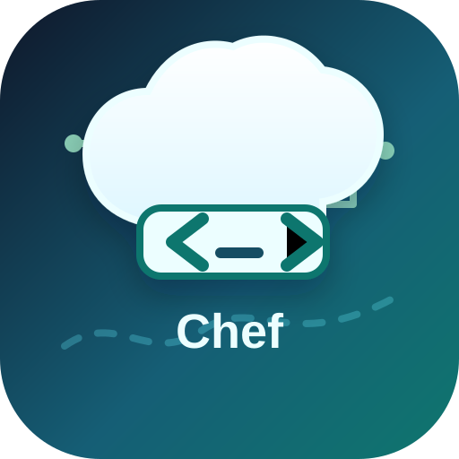

# Codex Chef

<p align="center">
  
  <br />
  
</p>

<p align="center">
  <a href="https://github.com/ucsahinn/codex-chef/actions/workflows/validate.yml"></a>
  <a href="LICENSE"></a>
  <a href="README.md"></a>
  
</p>

<p align="center">
   <strong>Dokümanlar:</strong>
  <a href="README.de.md">Deutsch</a> |
  <a href="README.es.md">Español</a> |
  <a href="README.md">English</a> |
  <a href="README.pt-BR.md">Português (Brasil)</a> |
  <a href="README.tr.md">Türkçe</a> |
  <a href="README.fr.md">Français</a>
</p>

Codex Chef, başkasının bilgisayarını kopyalamadan Codex’e güçlü ve denetlenebilir bir lokal çalışma düzeni kazandırır. Uzman ajanlar, incelenmiş skill’ler, temkinli MCP varsayılanları, ön izleme öncelikli installer’lar ve kendi çalıştırabileceğin doğrulama kapıları tek yerde gelir.

Codex Chef resmi OpenAI ürünü değildir; topluluk tarafından geliştirilen,
platform bağımsız bir Codex kurulum kitidir. Windows, macOS, Linux ve WSL
desteklenir. Destructive işlem, credential erişimi, database bağlantısı,
publish, deploy ve geniş filesystem erişimi açık onay olmadan çalışmaz.

Public giriş için altı README vardır. Ayrıntılı teknik dokümantasyon İngilizce ve Türkçe tutulur; diğer diller insan tarafından yazılmış kısa girişlerdir ve kanonik rehberlere yönlendirir.

##  Önce Ne Değişeceğini Gör

İlk olarak gereksinimleri kontrol et:

```powershell
Get-Command git
Get-Command node
Get-Command npx
Get-Command codex
node -v
```

Node.js 18 veya üzeri gerekir. Bir komut eksikse repoyu bozuk sanmadan önce [Sorun giderme](docs/troubleshooting.tr.md) sayfasına bak.

Repoyu klonla ve Codex home’a yazmadan planı gör:

```powershell
git clone https://github.com/ucsahinn/codex-chef.git
cd codex-chef
npm run chef -- --install
```

Ön izleme doğruysa kurulumu başlat:

```powershell
npm run chef -- --install --apply
```

macOS, Linux veya WSL:

```bash
git clone https://github.com/ucsahinn/codex-chef.git
cd codex-chef
npm run chef -- --install
npm run chef -- --install --apply
```

Installer yönetilen hedefleri değiştirmeden önce yedek alır. Normal kurulum ve repair, kullanıcıya ait skill, MCP, profil veya ilgisiz plugin dosyalarını prune etmez.
Renkli CLI önerilen public giriş yoludur. İleri düzey veya otomasyon amaçlı kullanımda
Windows üzerinde `scripts\install.ps1`, Bash sistemlerinde `scripts/install.sh` doğrudan
çağrılabilir; manifest tabanlı operasyon sözleşmesi `node scripts/plan-install.mjs --all --json --redact-paths` ile görülebilir.

##  CLI’ı Tahmin Etmeden Kullan

Numaralı komuta merkezi için `npm run chef` çalıştır.

| İhtiyaç | Komut |
| --- | --- |
| Hızlı repo sağlığı | `npm run chef -- --status --repo-only --no-log` |
| Tam durum panosu | `npm run codex:status` |
| Kurulum ön izlemesi | `npm run chef -- --preview` |
| Routing haritası | `npm run chef -- --routing --profile starter-health` |
| Diagnostik merkezi | `npm run chef -- --diagnostics --no-log` |
| Process denetimi | `npm run chef -- --processes` |
| Yönetilen dosyaları onar | `npm run chef -- --repair`, ardından `npm run chef -- --repair --apply` |
| Güncelleme ön izlemesi | `npm run chef -- --update --plain --no-log` |
| Güncelle ve doğrula | `npm run chef -- --update --apply` |

İnceleme komutları read-only kalır. Yazabilen komutlar `--apply` veya işleme özel typed confirmation ister. Repo-local ve redacted CLI logu istemiyorsan `--no-log` ekle.

Detaylı CLI davranışı [Kurulum](docs/install.tr.md), [Beklenen
çıktı](docs/expected-output.tr.md) ve [Sorun
giderme](docs/troubleshooting.tr.md) sayfalarında anlatılır.

##  Makineye Neler Kurulur?

| Yüzey | Gelenler |
| --- | --- |
|  Ajanlar | 21 isimlendirilmiş uzman rolü. Bunlar her zaman çalışan servisler değil, gerektiğinde sınırlı delegasyon için kullanılan rol dosyalarıdır. |
|  Skill’ler | Proje kapsamlı Codex Chef Brain dahil altı lokal plugin workflow’u ve on altı incelenmiş opsiyonel global skill. Skill’ler görev eşleştiğinde context’e girer, kendi kendine çalışmaz. |
|  MCP’ler | Resmi docs, güncel kütüphane docs’u, reasoning, browser kanıtı, semantic navigation, memory okuması ve `codebase-memory` ile lokal codebase graph okumaları için sekiz güvenli varsayılan. Hesap, database, production ve geniş filesystem connector’larından sekizi kapalı gelir. |
|  Çalışma sözleşmesi | Kalıcı `~/.codex/AGENTS.md`, routing profilleri, approval kuralları ve her ajanı tek modele kilitlemeyen token-safe profil seçenekleri. |
|  Güvenlik | Dry-run, manifest tabanlı kurulum planı, backup-first replacement, secret scan, package-surface kontrolü ve runtime doğrulaması. |

Skill'ler kendiliğinden çalışmaz; istek açıklamayla eşleştiğinde veya kullanıcı
skill'i adıyla çağırdığında context'e girer. Ajan rolü otomatik seçilir ama spawn
yalnız bağımsız paralel iş, gürültülü araştırmayı ayırma veya açık kullanıcı
isteği olduğunda yapılır.

##  Bilerek Yapmadığı Şeyler

- Secret saklamaz, browser session import etmez, private memory kopyalamaz ve maintainer servisine telemetry göndermez.
- GitHub, Figma, Linear, Notion, Sentry, Vercel, Supabase veya geniş filesystem erişimini varsayılan olarak açmaz.
- Commit, push, tag, release, deploy, package publish, credential rotation veya GitHub settings değişikliği yapmaz.
- Validation geçsin diye kullanıcı verisi silmez.

##  Akışı Gör

<p align="center">
  
</p>

##  Güven Sinyalleri

- `npm run check`; docs, installer, ajan, MCP, skill, routing, package içeriği, release metadata, supply-chain göstergeleri ve security sınırlarını doğrular.
- CI; Windows installer, Ubuntu/Node 18 ve macOS/Node 24 yollarını kapsar.
- `manifests/install-plan.json`, installer çalışmadan önce yönetilen write yüzeyini gösterir.
- Authenticated ve yüksek riskli connector’lar opt-in kalır.
- `package.json` içindeki `private: true`, source-first projenin yanlışlıkla npm’e publish edilmesini engeller.

Lokal doğrulama:

```bash
npm run check
npm run token:audit
npm run verify:skills:online
git diff --check
gitleaks detect --redact --no-banner --no-git --verbose
```

Uzun veya repo genelindeki çalışmalarda `npm run token:audit`, bağlam yükünün hangi yüzeylerden geldiğini gösterir. İsteğe bağlı `token-safe.config.toml` profili; ajanları, skill’leri, MCP’leri, memory’yi, hook’ları veya app’leri kapatmadan ayrıntı ve araç çıktısı sınırlarını düşürür. Ajan rolleri sabit model kullanmaz; otomatik `model/reasoning` seçimi etkin kullanıcı profilini izler.

##  Dokümantasyon

- [Türkçe dokümantasyon haritası](docs/README.tr.md)
- [English documentation map](docs/README.md)
- [Kurulum](docs/install.tr.md)
- [Güvenlik modeli](docs/security-model.tr.md)
- [Skill ve ajanlar](docs/skills-and-agents.tr.md)
- [MCP kataloğu](docs/mcp-catalog.tr.md)
- [Public hazırlık](docs/public-readiness.tr.md)
- [Advisory kaynakları](docs/advisory-sources.tr.md)
- [Bilgi bankası](kb/README.tr.md)
- [English knowledge base](kb/README.md)
- [Ajanlar için kısa indeks](llms.txt)

##  Katkı Ve Destek

Değişiklik açmadan önce [CONTRIBUTING.md](CONTRIBUTING.md), diagnostik paylaşmadan önce [SUPPORT.md](SUPPORT.md) dosyasını oku. Güvenlik raporları [SECURITY.md](SECURITY.md) içindeki private kanala gitmeli.

MIT lisanslıdır. Topluluk tarafından geliştirilir.
