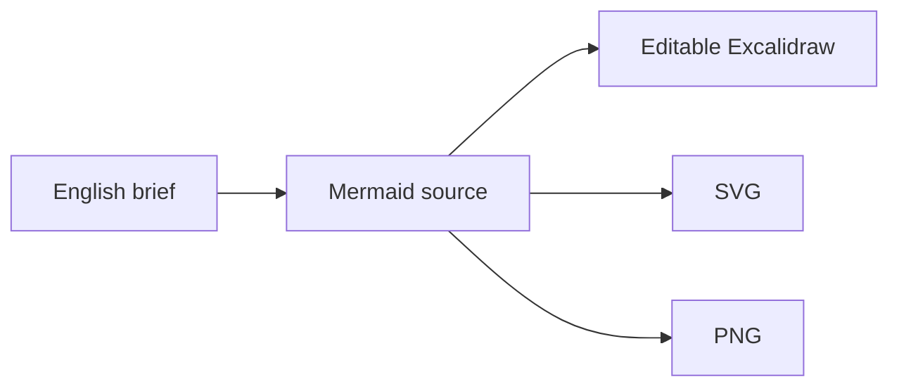
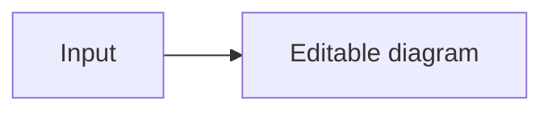

# Offline Diagram Triplet

Use this skill to turn an English diagram request into four local artifacts:

1. Mermaid source (`.mmd`)
2. Editable Excalidraw scene (`.excalidraw`)
3. Rendered SVG (`.svg`)
4. Rendered PNG (`.png`)

Also create a Markdown snippet when the user wants the Mermaid source embedded
in docs. Keep everything local and offline.

## Workflow

1. Convert the user's English brief into a small Mermaid `flowchart TD` or
   `flowchart LR`.
2. Keep labels short and inspectable. Prefer 4-12 nodes.
3. Save the Mermaid source to a `.mmd` file.
4. Run the bundled renderer:

```bash
node plugins/codex-chef-workflows/skills/offline-diagram-triplet/scripts/render-diagram-triplet.mjs --mermaid path/to/diagram.mmd --out-dir artifacts/diagrams --name diagram-name
```

5. Return the created file paths and include the Mermaid block in the response
   or target Markdown file.

## Reference Routing

Read `references/diagram-contract.md` before extending the renderer, handling
unsupported Mermaid syntax, changing output formats, or validating Excalidraw
compatibility. For ordinary small diagrams, follow the subset below.

## Mermaid Subset

Use this subset for predictable offline rendering:



Supported node forms:

- `A[Rectangle]`
- `B(Rounded)`
- `C((Ellipse))`
- `D{Decision}`
- `A --> B`
- `A -->|edge label| B`
- `A -.-> B`
- `A ==> B`
- `A --- B`

Avoid unsupported Mermaid features such as subgraphs, HTML labels, icons,
classDefs, click handlers, remote images, and sequence diagrams unless you
also implement or verify a renderer for them.

## Markdown Embedding

When writing docs, embed the source:

````markdown

````

The starter's `/make-pdf` style workflows can render Markdown Mermaid blocks
through their own PDF toolchain, while this skill still emits standalone local
assets for review and editing.

## Safety

- Do not use network services, CDN renderers, or remote Excalidraw libraries.
- Do not install packages to render diagrams.
- Do not put secrets, private paths, tokens, or credential material into diagram
  labels or output filenames.
- If the diagram must include private system names, keep artifacts local and
  do not commit them without explicit approval.
